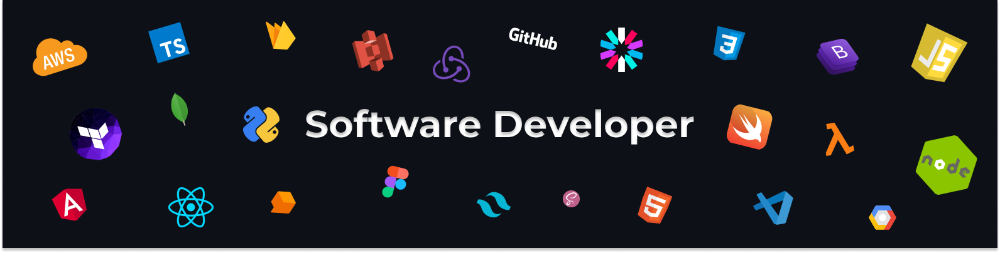

  
### 👋 About Me

Hi, I'm Kumaran - a graduate of the University of Kelaniya Sri Lanka As a Software developer with 1+ years of experience, I am skilled in using Node.js, React JS, Laravel and many Javascript based technologies to build scalable, high-performance web applications. I am excited about the potential of these technologies and am always looking for opportunities to learn and grow as a developer.

## 💻 Things I code with

### 👨‍💻 Languages

### 🧰 Frameworks & Libraries

### ☁️🗄️ Cloud hosting & Database

### ⚙️ Softwares & Tools

## 💻 Recent Blog Posts

<a href="https://medium.com/towards-aws/save-big-on-serverless-5-ways-to-reduce-your-aws-lambda-costs-45675d32b9ed" target="_blank">What is clean code?</a>
 
<a href="https://medium.com/towards-aws/beginners-guide-to-running-docker-containers-on-aws-lambda-part-1-f7e0a402b168" target="_blank">Software Quality Factors</a>
 

## 👋 Find Me On

     

 

